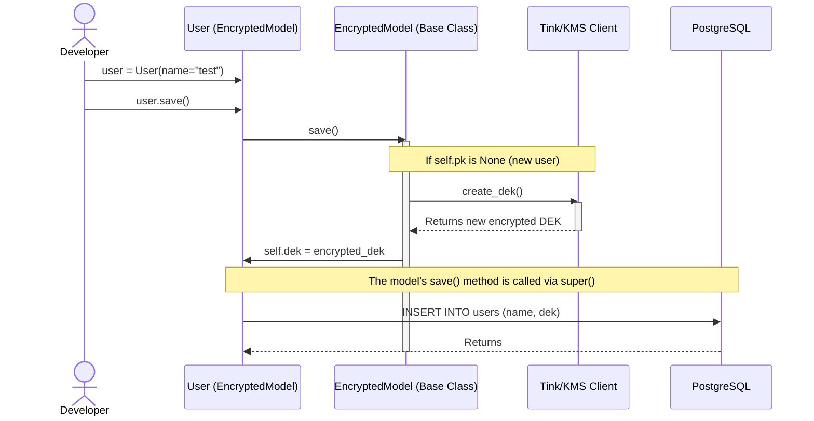
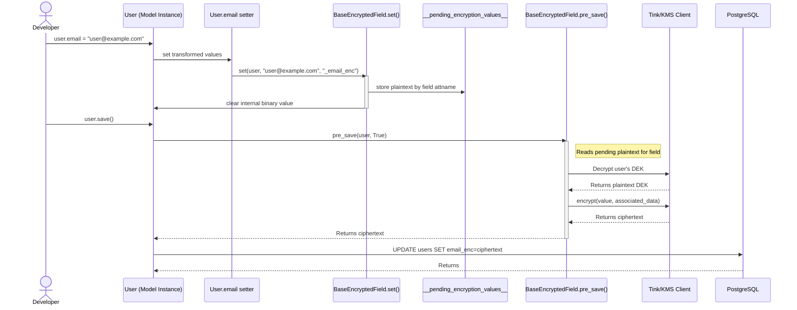
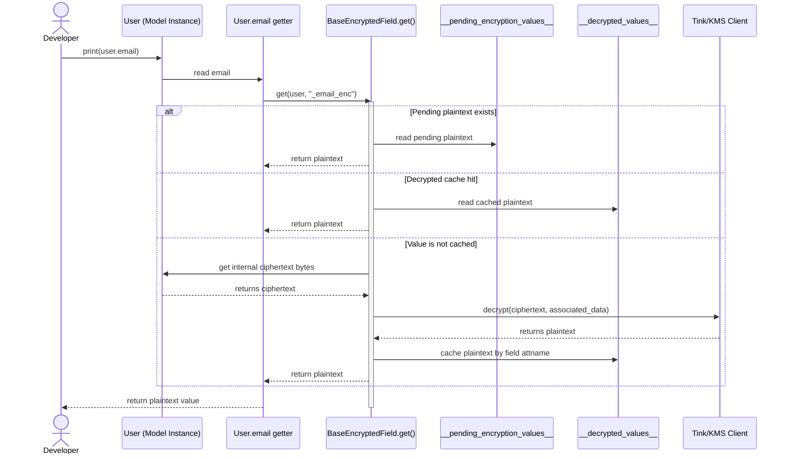
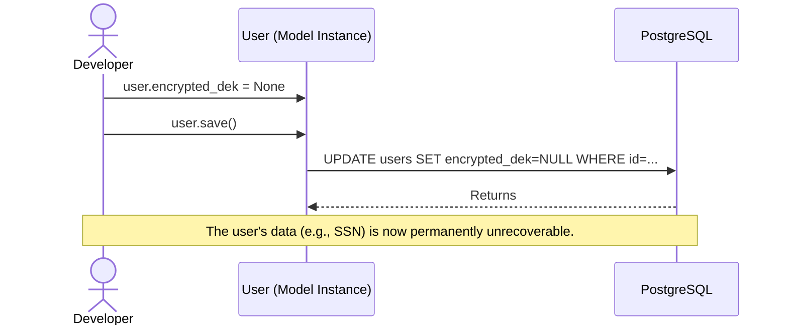
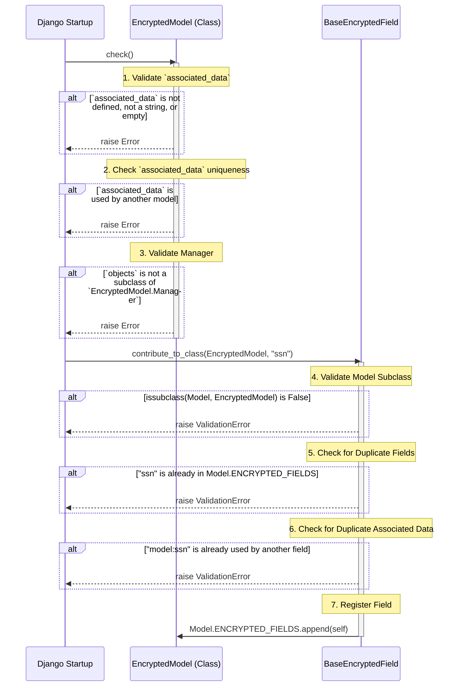
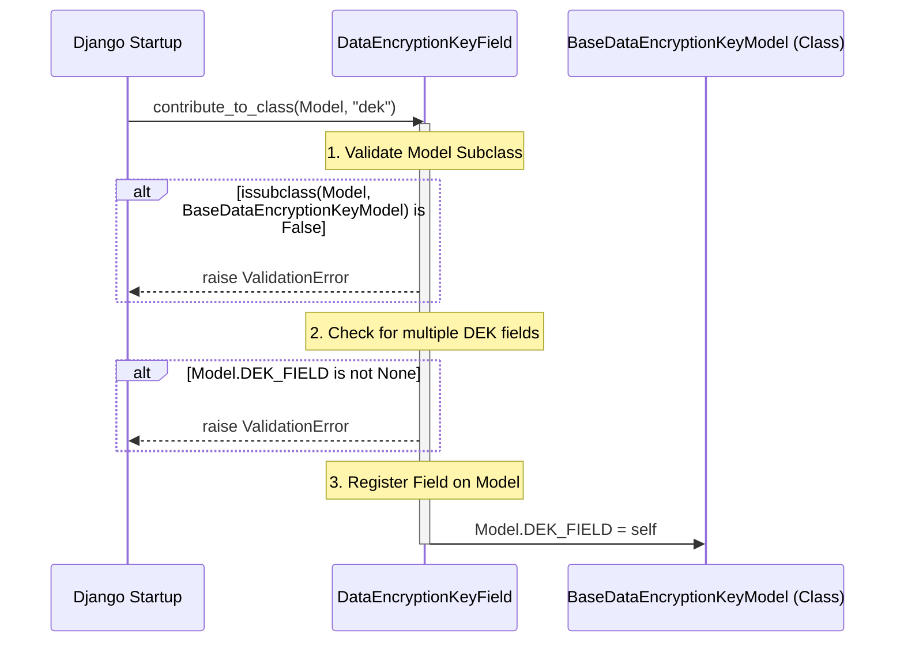
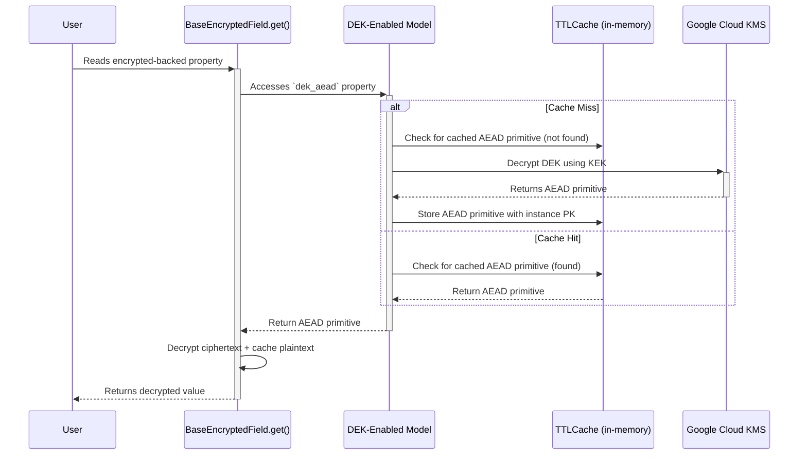
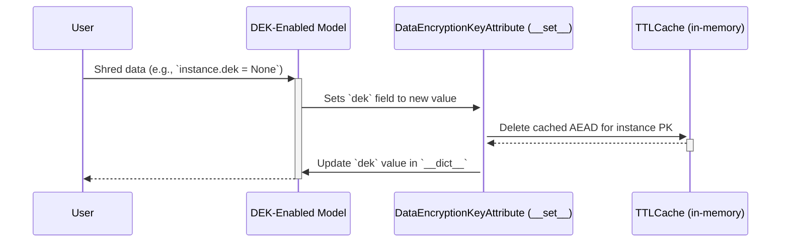

# Client-Side Encryption

Client-Side Encryption with Per-User Keys and Django ORM Integration

---

## 1. Executive Summary

This architecture implements **Application-Layer Encryption** (often called **Client-Side Encryption** relative to the database) using a **Per-User Key** strategy.

Instead of relying on a single global key (which is a single point of failure), every user in the system is assigned a unique **Data Encryption Key (DEK)**. This key wraps their specific data. These DEKs are themselves encrypted by a master **Key Encryption Key (KEK)** managed by **Google Cloud KMS**.

**Security Guarantee:** The database (PostgreSQL) never sees plaintext data or the plaintext keys required to decrypt it. A database leak results in zero data compromise without also compromising the running application server and Google Cloud credentials.

This document outlines an approach that seamlessly integrates this encryption strategy into the **Django ORM**, making the encryption and decryption of data transparent to the developer.

---

## 2. Architecture Overview

### The "Two-Key" Envelope System

We utilize a hierarchy of keys to balance security and performance.

1. **KEK (Key Encryption Key):**
    * **Location:** Google Cloud KMS (Hardware Security Module).
    * **Role:** The "Master Lock." It never leaves Google. It is used only to encrypt/decrypt the User Keys (DEKs).
2. **DEK (Data Encryption Key):**
    * **Location:** Encrypted in the database (e.g., in the `users` table); Decrypted only in Application Memory (RAM).
    * **Role:** The "Worker Bee." Unique to every user. Used to encrypt/decrypt the actual database fields (e.g., SSNs, names).

---

## 3. Encryption/Decryption Utilities

At the core of this system are a few utility functions that interact with Google Cloud KMS and the `tink` cryptography library. In addition, to avoid a dependency on Google Cloud KMS during local development and in CI/CD pipelines, we use fake (mock) implementations of the KMS client and its AEAD primitive.

**[codeforlife/encryption.py](../codeforlife/encryption.py)**

---

## 4. Django ORM Integration

To make working with encrypted data seamless, we've integrated the encryption logic directly into Django's ORM. This is achieved through a combination of a base model class, custom model fields, and explicit property accessors.

### Associated Data for Integrity

A core principle of this architecture is the use of **Associated Data** to ensure the integrity of encrypted values. Authenticated Encryption with Associated Data (AEAD) algorithms, like the AES-GCM we use, bind a piece of ciphertext to a specific context. This means that ciphertext encrypted in one context cannot be decrypted in another, which prevents certain attacks like swapping encrypted values between different database columns or rows.

To achieve this, we enforce the use of an `associated_data` string at two levels:

1. **Model-level:** Every `EncryptedModel` subclass must define a unique `associated_data` string. This scopes all encrypted fields within that model.
2. **Field-level:** Every `BaseEncryptedField` instance must be initialized with its own `associated_data` string, which must be unique within that model.

These two strings are combined to create a fully qualified identifier that is passed to the encryption and decryption functions. This provides two critical layers of integrity:

1. **Field-Level Integrity:** Consider a `Balance` model with two encrypted fields, `debit` and `credit`. The field-level AD ensures their values cannot be swapped. The AD for each would be `"balance:debit"` and `"balance:credit"`. An encrypted debit value cannot be moved to the credit column, as the decryption would fail due to the AD mismatch.

2. **Model-Level Integrity:** Now consider two different models, `Debit` and `Credit`, each with an encrypted `balance` field. The model-level AD prevents swapping values between them. The AD would be `"debit:balance"` and `"credit:balance"`. An encrypted balance from a `Debit` instance cannot be moved to a `Credit` instance, again because the AD would not match during decryption.

### Implementation

The implementation details can be found in the docstring of these files. It's recommended you read them in the following order.

1. **[codeforlife/models/encrypted.py](../codeforlife/models/encrypted.py):** This is the base class for any model that will contain encrypted fields.
1. **[codeforlife/models/fields/base_encrypted.py](../codeforlife/models/fields/base_encrypted.py):** This is where the core logic of transparent encryption and decryption happens.
1. **[codeforlife/models/fields/encrypted_text.py](../codeforlife/models/fields/encrypted_text.py):** A concrete encrypted text field which subclasses `BaseEncryptedField`.
1. **[codeforlife/models/base_data_encryption_key.py](../codeforlife/models/base_data_encryption_key.py):** This abstract model brings the `EncryptedModel` and `DataEncryptionKeyField` together.
1. **[codeforlife/models/data_encryption_key.py](../codeforlife/models/data_encryption_key.py):** This model inherits from `BaseDataEncryptionKeyModel` and conveniently includes the `dek` field by default.
1. **[codeforlife/models/fields/data_encryption_key.py](../codeforlife/models/fields/data_encryption_key.py):** This field is responsible for managing the lifecycle of a DEK for a model instance.

### Field Access and Transformation Pattern

The current `BaseEncryptedField` flow is based on explicit helpers rather than descriptor-based type mutation.

1. **Internal storage type:** encrypted model columns store ciphertext bytes.
2. **Set path:** call `BaseEncryptedField.set(instance, plaintext, field_name)` to stage plaintext in pending-encryption storage.
3. **Save path:** `pre_save()` encrypts staged plaintext and writes ciphertext bytes to the DB.
4. **Get path:** call `BaseEncryptedField.get(instance, field_name)` to return plaintext by reading pending values, decrypted cache, or decrypted ciphertext.

When domain logic requires additional transforms, expose a property and perform all transformation logic in that property getter/setter.

Examples:

* **On set:** normalize the plaintext value, then encrypt and hash it.
* **On get:** decrypt the encrypted value.

### Querying by Sensitive Values

Encrypted ciphertext is non-deterministic by design, so it cannot be queried with equality semantics. For lookup use-cases (e.g., username/email), store a deterministic one-way hash in a parallel `Sha256Field`.

* Use `Sha256Field.set(instance, plaintext, "field_hash")` in property setters.
* Query exact matches with `User.objects.filter(_email_hash__sha256="user@example.com")`.
* Query multi-value matches with `User.objects.filter(_email_hash__sha256_in=["a@b.com", "c@d.com"])`.

### Field Aliases and Partial Saves

When saving with `update_fields`, aliases are expanded to their real fields by `Model.save()`.

* Define alias mappings with `field_aliases`.
* Save using alias names (e.g., `update_fields={"email"}`) and all dependent columns (e.g., encrypted, hash) are persisted.

---

## 5. Usage Patterns

Here are two common patterns for using the encryption framework.

### Pattern 1: Self-Contained Encrypted Model

This is the simplest pattern. The model inherits from `DataEncryptionKeyModel`, which means it manages its own DEK and can have one or more encrypted fields. This is ideal for models that represent a primary entity, like a `User`.

```python
class User(DataEncryptionKeyModel):
    """
    A user model with an encrypted email. Because it inherits from
    DataEncryptionKeyModel, it automatically gets a 'dek' field to manage
    its own encryption key.
    """
    associated_data = "user" # Required for EncryptedModel
    field_aliases = { # Keys/Aliases are replaced with values on save().
        "email": {"_email_enc", "_email_hash"},
    }

    _email_enc = EncryptedTextField(associated_data="email")
    _email_hash = Sha256Field()

    @property
    def email(self):
        return EncryptedTextField.get(self, "_email_enc")

    @email.setter
    def email(self, value: str):
        value = self.__class__.objects.normalize_email(value)
        EncryptedTextField.set(self, value, "_email_enc")
        Sha256Field.set(self, value, "_email_hash")

    class Meta:
        app_label = "auth"

# --- Usage ---

# Create a new user.
# A new DEK is automatically generated and stored in the 'dek' field.
# The property setter handles encrypted + hash values.
user = User.objects.create_user(
    email="john.doe@example.com"
)

# The encrypted value is stored as bytes in '_email_enc'.
# The property getter returns plaintext.
print(f"User's email: {user.email}")
# >>> User's email: john.doe@example.com

# You can update the email as you would with a normal field.
user.email = "john.doe.new@example.com"
# Alias expansion saves all backing columns.
user.save(update_fields={"email"})
```

### Pattern 2: Delegated Encryption Key

Sometimes, you have a model whose data should be encrypted under another object's key. For example, a `Secret` that belongs to a `User`. The `Secret` itself doesn't need its own DEK; it should be encrypted with the `User`'s DEK.

In this case, the model inherits directly from `EncryptedModel` and must implement the `dek_aead` property to point to the key provider (the `User` model in this case).

```python
class Secret(EncryptedModel):
    """
    A model that stores a secret value. It does not have its own DEK.
    Instead, it relies on the related User's DEK for encryption.
    """
    associated_data = "secret" # Required for EncryptedModel

    user = models.ForeignKey(User, on_delete=models.CASCADE, related_name="secrets")

    _secret_value = EncryptedTextField(associated_data="secret-value")

    @property
    def secret_value(self):
        return EncryptedTextField.get(self, "_secret_value")

    @secret_value.setter
    def secret_value(self, value: str):
        EncryptedTextField.set(self, value, "_secret_value")

    class Meta:
        app_label = "app"

    @property
    def dek_aead(self) -> Aead:
        """
        This model delegates encryption to the associated user's DEK.
        The `dek_aead` property is implemented to return the user's AEAD primitive.
        """
        return self.user.dek_aead

# --- Usage ---

# Assume 'user' is the User instance created in the previous example.
secret = Secret.objects.create(
    user=user,
    secret_value="my-super-secret-password"
)

# The 'secret_value' is encrypted using the DEK from the 'user' object.
# When accessed, it's decrypted using the same key.
print(f"The secret is: {secret.secret_value}")
# >>> The secret is: my-super-secret-password
```

---

## 6. Sequence Diagrams

This section contains diagrams that explain what the Django ORM is doing.

### 1. DEK Generation and Initial Save

This diagram shows the process that occurs when a new DEK-enabled model instance (e.g., a `User`) is created and saved for the first time. `BaseDataEncryptionKeyModel.save()` lazily manages creation of the user-specific DEK.



### 2. Data Encryption

This diagram illustrates what happens when a developer sets a value via a property that uses `BaseEncryptedField.set()`. The value is staged for encryption, and encryption happens later during `save()`.



### 3. Data Decryption

This diagram shows the process of reading a value via a property that uses `BaseEncryptedField.get()`. It checks pending plaintext first, then decrypted cache, then decrypts ciphertext from storage.



### 4. Data Shredding

Data shredding is achieved by nullifying the user's encrypted DEK. Once the key is gone, the data associated with it is rendered permanently unrecoverable.



### 5. Encrypted Model and Field Initialization

This diagram shows how an encrypted model and its fields are initialized and validated when Django starts up.



### 6. DEK Model and Field Initialization

This diagram details the validation that occurs when a `DataEncryptionKeyField` is added to a model. The field's `contribute_to_class` method ensures that the model is a valid `BaseDataEncryptionKeyModel` and that it contains only one DEK field.



### 7. DEK AEAD Caching

To minimize latency and cost associated with decrypting the Data Encryption Key (DEK) via GCP KMS, the system employs an in-memory, time-to-live (TTL) cache for the AEAD primitive (`DEK_AEAD_CACHE`).

The following diagrams illustrate the two main caching flows: retrieval (cache hit/miss) and invalidation.

#### 7.1. Cache Retrieval (Hit & Miss)

This diagram shows how the `dek_aead` property on a `BaseDataEncryptionKeyModel` instance leverages the cache. A cache hit returns the stored AEAD primitive immediately, while a cache miss triggers a call to GCP KMS to decrypt the key, which is then cached for subsequent requests.



#### 7.2. Cache Invalidation

The cache must be invalidated whenever the underlying DEK changes to prevent the use of stale keys. This happens automatically when the `DataEncryptionKeyField` is set, for example, during a data shredding operation where the key is set to `None`.


